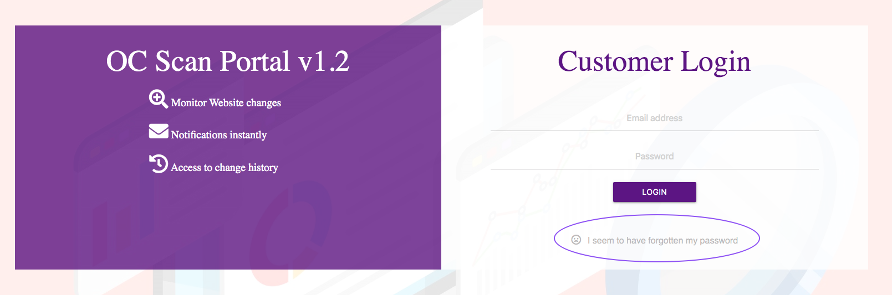
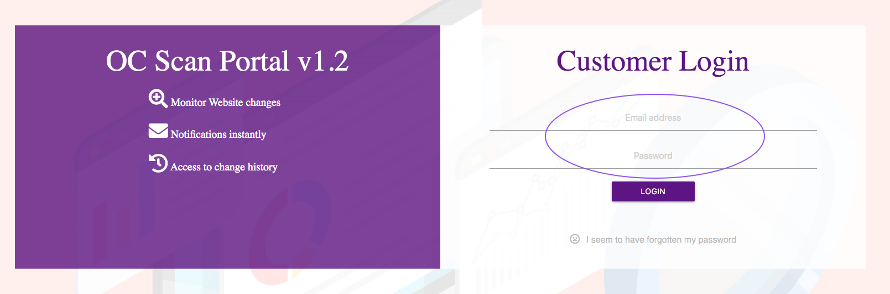
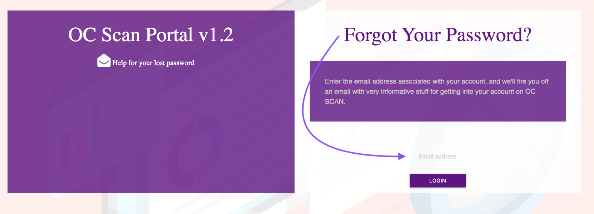
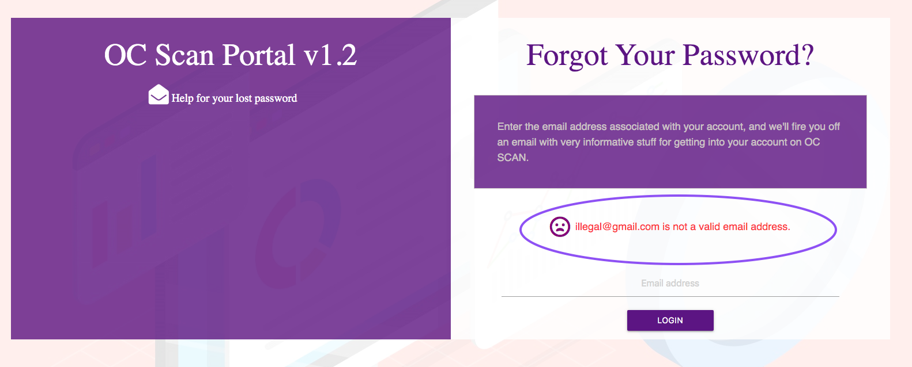
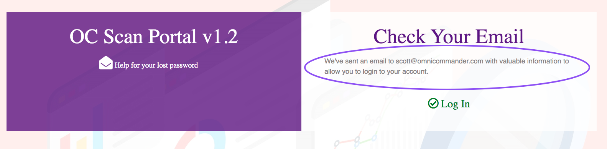
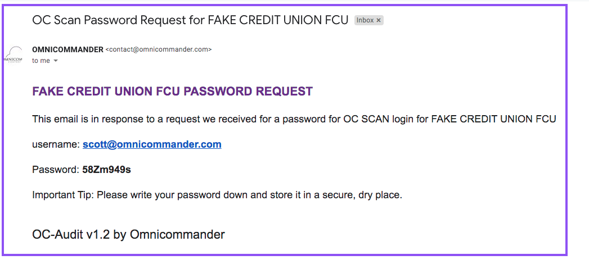

# osc-audit by omnicommander

### Install dependencies for oc-audit
`cd oc-audit/src `

`npm install`

### First time only, install nodemon module
`npm i nodemon`

Then, just run dev app for localhost enviroment.

`npm run dev`

[http://localhost:8080](http://localhost:8080) to access front end with your browser.

### run auditRunnerservice

`cd auditRunnerService`

`npm run start --dev` for localhost

## Screenshots and explanation

The new Customer login form, username and password fields with a link for `forgot my password`

Enter email address and password of customer

The Forgot Password form. User enters the email address of the account, and submits.

The system doesn't find an email address in the Customers table, and displays the message.

The notification screen, telling the visitor to check thier email for the password.

The email the visitor recieves for the password 

